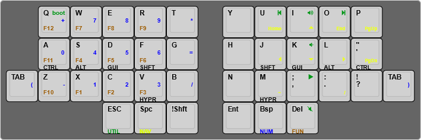
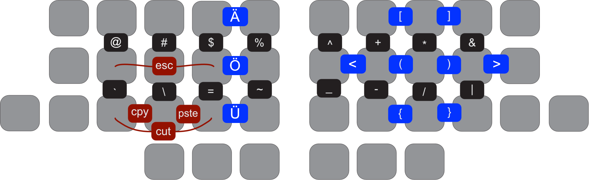

```
                                                       ▀▀▀▀▀     ▀▀▀▀▀          ▀▀█▀▀
                                                       ▄▀▀▀▄  ▄  ▄▀▀▀▄  ▄  ▄▀▀▀▄  █  ▄▀▀▀▄
                                                       █   █  █  █   █  █  █   █  █  █   █
                                                        ▀▀▀   █   ▀▀▀   █   ▀▀▀   ▀   ▀▀▀
                                                              █      ▄▄▄█▄▄▄    █   █  
                                                              ▀      █  █  █     █▄█
                                                            ▀▀▀▀▀    █  █  █      ▀
                                                                     ▀  ▀  ▀
▄▄▄▄▄▄▄▄▄▄▄▄▄▄▄▄▄▄▄▄▄▄▄▄▄▄▄▄▄▄▄▄▄▄▄▄▄▄▄▄▄▄▄▄▄▄▄▄▄▄▄▄▄▄▄▄▄▄▄▄▄▄▄▄▄▄▄▄▄▄▄▄▄▄▄▄▄▄▄▄▄▄▄▄▄▄▄▄▄▄▄▄▄▄▄▄▄▄▄▄▄▄▄▄▄▄▄▄▄▄▄▄▄▄▄▄▄▄▄▄▄▄▄▄▄▄▄▄▄▄▄▄▄▄▄▄▄▄▄▄▄▄▄▄▄▄▄▄▄
       
```
# TOTEM split keyboard

TOTEM is 34 keys column-staggered split keyboard made by @geigeigeist. It uses the Seeed XIAO RP2040.

You can use this command to compile the firmware
`qmk compile -kb totem -km totem`

<figure>

</figure>

<figure>

</figure>
